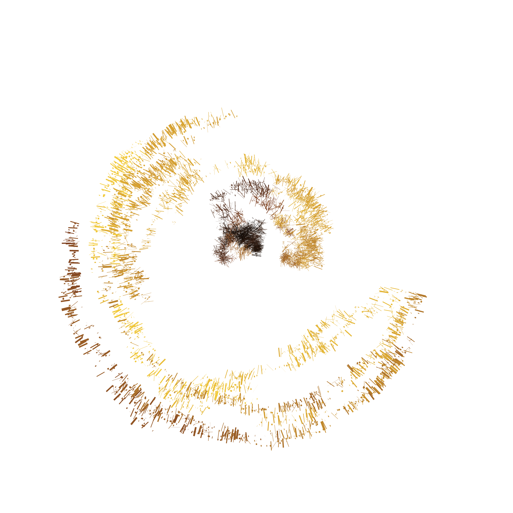

<!-- README.md is generated from README.Rmd. Please edit that file -->

# damage

<!-- badges: start -->

[](https://github.com/djnavarro/damage/actions)
<!-- badges: end -->

The goal of damage is to make generative art. You can install the
development version from [GitHub](https://github.com/) with:

``` r
remotes::install_github("djnavarro/damage")
```

To generate pieces:

``` r
library(damage)
damage(seed = 11)
```


``` r
damage(seed = 12)
```


``` r
damage(seed = 13)
```


